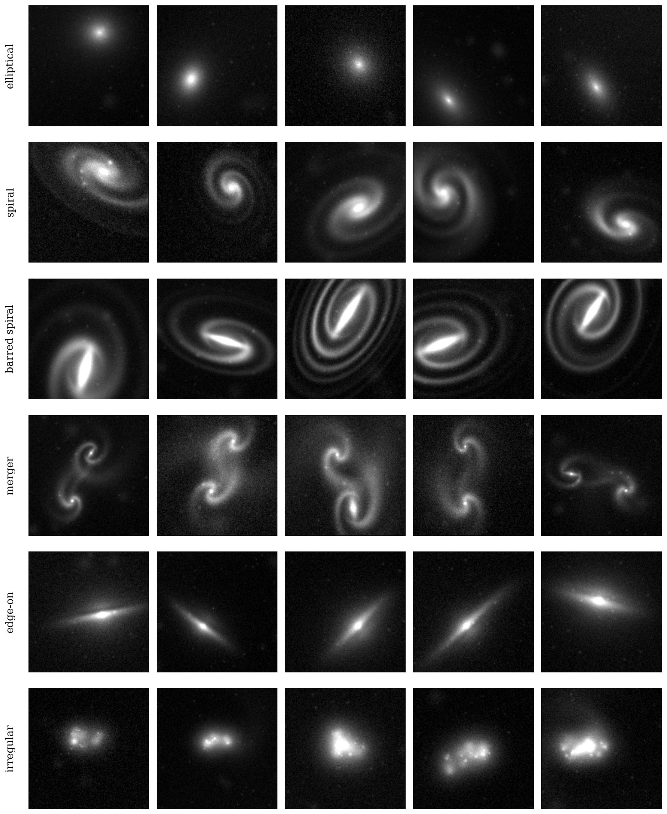

# galaxy-textures

A small procedural image set for galaxy-morphology experiments. It is built
with PyTorch and explicit analytic shapes, so the signals are easy to control
and the output stays readable for interpretability work. It is not a physical
simulation and it is not calibrated to real survey data.

The main idea is simple: each galaxy type is rendered by its own module, the
shared dispatcher lives in one place, and the example script shows the whole
set in one grid. That keeps the code easy to skim when you want to see what a
given class actually does.

## Texture Grid



Each row shows a different class, with 5 realizations per class.

## What Lives Where

| file | what it does |
|---|---|
| [galaxy_zoo/generator.py](galaxy_zoo/generator.py) | Public `make_galaxy` entry point and class dispatch. |
| [galaxy_zoo/elliptical.py](galaxy_zoo/elliptical.py) | Smooth elliptical renderer with a warped outer halo. |
| [galaxy_zoo/spiral.py](galaxy_zoo/spiral.py) | Spiral renderer with bifurcating arms and HII knots. |
| [galaxy_zoo/barred_spiral.py](galaxy_zoo/barred_spiral.py) | Barred spiral renderer with arms anchored at the bar tips. |
| [galaxy_zoo/merger.py](galaxy_zoo/merger.py) | Interacting pair renderer with bridge and tidal tails. |
| [galaxy_zoo/edge_on.py](galaxy_zoo/edge_on.py) | Edge-on disk renderer with dust lane and flare. |
| [galaxy_zoo/irregular.py](galaxy_zoo/irregular.py) | Clumpy irregular renderer with optional tidal debris. |
| [galaxy_zoo/shared.py](galaxy_zoo/shared.py) | Shared satellites, background, and noise helpers. |
| [examples/render_grid.py](examples/render_grid.py) | Quick visual check that samples all six classes. |

## Classes

| kind | name | what it looks like |
|---|---|---|
| 0 | elliptical | Smooth bulge with a warped halo |
| 1 | spiral | 2-3 arms, occasional bifurcation, bright knots |
| 2 | barred spiral | Compact bar with arms rooted at the bar ends |
| 3 | merger | Two interacting disks with bridge and tails |
| 4 | edge-on | Thin disk, bulge, dust lane |
| 5 | irregular | Clumpy body with noisy, disturbed structure |

## Install

```bash
pip install -r requirements.txt
# or, as an editable package:
pip install -e .
```

## Use It

```python
import torch
from galaxy_zoo import CLASSES, make_galaxy

torch.manual_seed(0)
img = make_galaxy(kind=1, size=128)
# img is a torch.Tensor with shape (1, 128, 128)

# Merger-only overrides:
img = make_galaxy(kind=3, size=128, stage=0.8, merger_barred=True)
```

To preview the whole set as a grid:

```bash
python examples/render_grid.py --out galaxy_textures_grid.png
```

## Notes

This is intentionally stylized. A few important simplifications:

- Single-band grayscale only, so you do not get real color cues.
- Gaussian noise is added, but there is no PSF/seeing model.
- Merger structure is a controlled cartoon of tidal interaction, not an N-body
  simulation.
- The classes are cleaner than real survey data on purpose, which makes the
  set better for demos than for benchmarking survey-grade classification.

## License

MIT. See [LICENSE](LICENSE).
